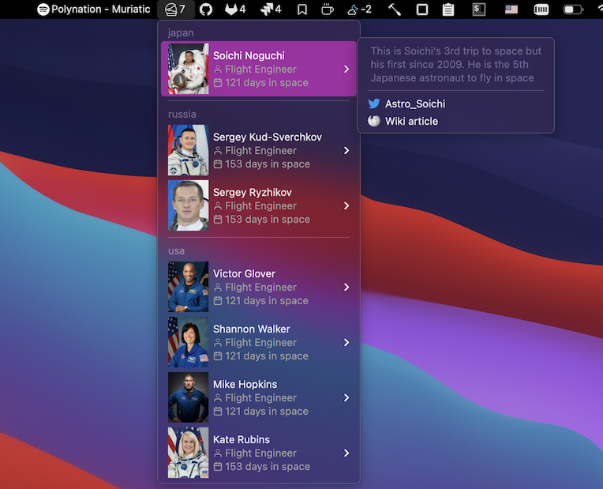

# people in space

Shows number of people currently in space:



# Installation

 - install [Hammerspoon](http://www.hammerspoon.org/) - a powerfull automation tool for OS X
   - Manually:

      Download the [latest release], and drag Hammerspoon.app from your Downloads folder to Applications.
   - Homebrew:

      ```brew install hammerspoon --cask```

 - download [people-in-space.spoon](https://github.com/fork-my-spoons/people-in-space.spoon/raw/master/people-in-space.spoon.zip), unzip and double click on a .spoon file. It will be installed under `~/.hammerspoon/Spoons` folder.
 
 - open ~/.hammerspoon/init.lua and add the following snippet, adding your parameters:

```lua
-- people in space
hs.loadSpoon('people-in-space')
spoon['people-in-space']:start()
```

This app uses icons, to properly display them, install a [feather-font](https://github.com/AT-UI/feather-font) by [downloading](https://github.com/AT-UI/feather-font/raw/master/src/fonts/feather.ttf) this .ttf font and installing it.
